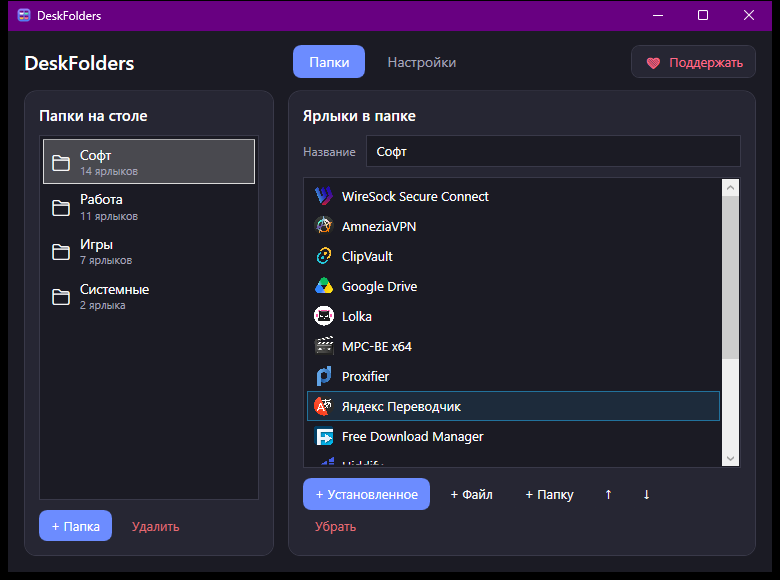
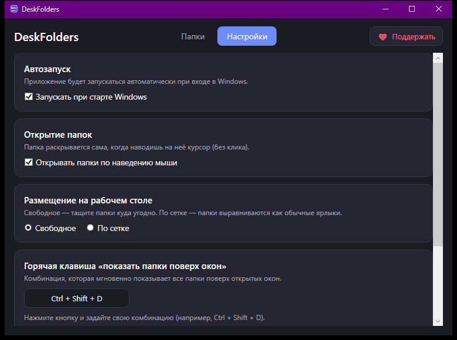

<div align="center">

# 📁 DeskFolders

**Папки на рабочем столе Windows — как на смартфоне.**
Сгруппируйте ярлыки в аккуратные плитки-папки, а по горячей клавише покажите их поверх любых окон.

[](../../releases/latest)
[](LICENSE)
[](https://yoomoney.ru/to/4100119273215272)



</div>

## Что это

**DeskFolders** превращает беспорядок из ярлыков на рабочем столе в компактные папки. Кликнули по папке — открылась красивая сетка приложений, выбрали нужное — запустилось. А ещё есть режим «поверх окон»: одна горячая клавиша — и все ваши папки всплывают поверх открытых программ, чтобы быстро что-то запустить не сворачивая работу.

Приложение живёт в системном трее, не занимает панель задач и не мешает.

## Возможности

- 🗂️ **Папки-плитки на рабочем столе** — группируйте ярлыки как удобно.
- ✨ **Раскрытие в сетку** — по клику или по наведению мыши.
- ⌨️ **Показ поверх окон по горячей клавише** — комбинация настраивается.
- 🧲 **Два режима размещения** — свободное (тащите куда угодно) или по сетке (как обычные ярлыки).
- 🚀 **Автозапуск с Windows** — включается одной галочкой.
- 🖱️ **Перетаскивание файлов прямо в папку** — ярлык добавится сам.
- 🎨 **Тёмный аккуратный интерфейс**, всё на русском.
- 🪶 **Лёгкое и автономное** — не требует установленного .NET.

<div align="center">



</div>

## Установка

1. Откройте страницу **[Releases](../../releases/latest)** и скачайте `DeskFolders-Setup.exe`.
2. Запустите установщик. Он ставится **для текущего пользователя** (без прав администратора) в `%LocalAppData%\Programs\DeskFolders`.
3. В мастере можно сразу поставить галочки «ярлык на рабочий стол» и «запускать при старте Windows».
4. Готово — значок появится в трее, а на рабочем столе возникнет первая папка.

> Windows SmartScreen может предупредить о «неизвестном издателе», т.к. приложение новое и без платной подписи. Нажмите **Подробнее → Выполнить в любом случае**.

Удаление — обычным способом через **Параметры → Приложения**. Установщик за собой всё подчищает, включая запись автозапуска.

## Как пользоваться

- **Открыть папку** — клик по плитке (или наведение, если включено в настройках).
- **Показать все папки поверх окон** — горячая клавиша (по умолчанию `Ctrl + Shift + D`).
- **Добавить ярлык** — перетащите файл на папку или через **Менеджер → + Установленное / + Файл / + Папку**.
- **Настроить** — правый клик по значку в трее → «Менеджер папок…», вкладка **Настройки**.

## Сборка из исходников

Нужен **.NET SDK 6.0+** и Windows.

```bash
git clone https://github.com/wufcorp/DeskFolders.git
cd DeskFolders/DeskFolders
dotnet run -c Release
```

Автономная сборка (со встроенным .NET, как в релизе):

```bash
dotnet publish -c Release -r win-x64 --self-contained true -o publish-sc
```

Сборка установщика (нужен [Inno Setup 6](https://jrsoftware.org/isdl.php)):

```bash
ISCC.exe installer/DeskFolders.iss
```

## ❤ Поддержать автора

DeskFolders бесплатен и с открытым исходным кодом. Если он вам пригодился — можно поблагодарить автора любой суммой (от 10 ₽). Это очень мотивирует развивать проект. Спасибо!

<div align="center">

### [→ Поддержать через YooMoney](https://yoomoney.ru/to/4100119273215272)

</div>

## Лицензия

[MIT](LICENSE) © 2026 wufcorp
